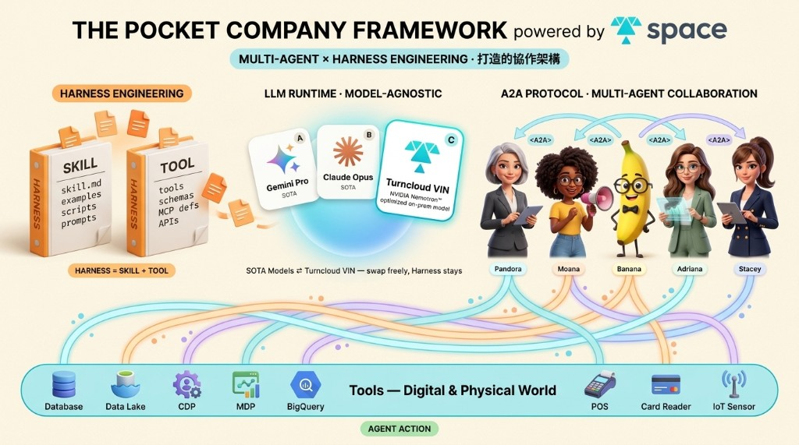

# VIN


**VIN is an on-premise-first multi-agent AIOS for teams that want agentic AI without sending their data to a cloud model by default.**

It packages the **The Pocket Company Framework** into an open-source distribution: local model runtime, harness engineering, tool calling, memory, skills, browser-backed web search, and a polished chat UI that can run against Ollama on your own machine.



VIN is built with The Pocket Company and Turn Cloud / TSpace ecosystem in mind: the open-source cut is designed for teams that need local models, tool governance, and browser/computer-use style capabilities around real enterprise workflows.

**中文簡介：**VIN 是一套以地端部署為優先的多代理 AIOS。它把 The Pocket Company 的協作式 agent harness、Turn Cloud（騰雲科技）與 TSpace 生態中的企業資料場景包裝成可開源、可自架、可替換模型的系統底座。預設支援 Ollama、本地模型、工具調用軌跡、網路搜尋、記憶與技能管理，適合不希望把企業資料預設送到雲端模型的團隊。

Demo clip: [TurnCloud stock lookup with visible tool use](docs/assets/turncloud-stock-demo.mp4)

## Why VIN Exists

Most agent frameworks quietly assume three things:

- you have an OpenAI / Anthropic / Google key,
- your data is allowed to leave your network,
- and your model will follow perfect JSON function-calling instructions.

VIN assumes the opposite. It starts from the enterprise reality: Qwen, Nemotron, Gemma, or another open-weight model is already running behind your firewall through Ollama, vLLM, LM Studio, llama.cpp, or an OpenAI-compatible endpoint. What you need is the harness around it: agents, tools, policies, memory, skills, observability, and a UI that makes tool use visible.

## What Is Inside

VIN has three layers:

| Layer | What it does |
|---|---|
| **LLM Runtime** | Model-agnostic provider layer for Ollama, OpenAI-compatible runtimes, and optional Gemini burst. |
| **Harness Engineering** | ReAct loop, native function calling, regex fallback, fail-closed tool gate, policies, memory, skills, MCP tools, SSRF protection, and untrusted-content boundaries. |
| **Multi-Agent Surface** | `Vin` orchestrator, `Researcher` agent, web UI, visible tool traces, and browser-backed web search. |

The result is a local-first agent stack that can still plug into cloud services when you choose to, not because the framework requires it.

## Highlights

- **On-premise by default** — Ollama provider uses local `/api/chat`, `/api/embed`, and `/api/tags`.
- **Model agnostic** — Qwen, Nemotron, Gemma, vLLM, LM Studio, llama.cpp server, TGI, OpenAI-compatible endpoints.
- **Tool calling that survives imperfect local models** — native function calling first, regex fallback second, policy gate always fail-closed.
- **Web search built for open source** — pluggable providers inspired by Hermes Agent: Tavily, Brave, Serper, SearXNG, Browser/CDP, DuckDuckGo Instant Answer fallback.
- **Computer-use style search fallback** — `puppeteer-core` drives the user's installed Chrome, so open-source users can search without API keys.
- **Visible reasoning and tool traces** — the web UI shows the agent's reasoning, selected tool, provider, query, duration, and raw results.
- **Memory and skills** — SQLite-backed hybrid keyword/vector memory plus progressive-disclosure skills.
- **Security boundaries** — SSRF guard and untrusted-content wrappers live in code, not just prompts.

## Quickstart

### 1. Run Ollama

```bash
git clone https://github.com/accucrazy/VIN.git
cd VIN

cp .env.example .env
docker compose up -d
./scripts/setup-models.sh --tier balanced --family qwen
```

Or use native Ollama:

```bash
ollama serve
ollama pull qwen2.5:14b
ollama pull nomic-embed-text
```

### 2. Run the harness

```bash
npm install
npx tsx src/index.ts
```

### 3. Run the web chat UI

```bash
cd web
npm install
npm run dev
```

Open [http://localhost:3001](http://localhost:3001).

## Web Search Providers

VIN auto-detects whichever search backend you configure:

| Provider | Env | Notes |
|---|---|---|
| Tavily | `TAVILY_API_KEY` | AI-oriented search API. |
| Brave | `BRAVE_API_KEY` | Search API with free tier. |
| Serper | `SERPER_API_KEY` | Google SERP API. |
| SearXNG | `SEARXNG_URL` | Self-hosted, no key. |
| Browser/CDP | `CHROME_PATH` optional | No key. Drives a real Chrome via `puppeteer-core`. |
| DDG Instant | none | Last-resort entity-summary fallback. |

Set `SEARCH_PROVIDER=browser` or another provider name if you want to pin one. Otherwise VIN falls through automatically.

## Model Selection

| Need | Pick | Why |
|---|---|---|
| Balanced workstation agent | `qwen2.5:14b` | Strong default tool-use / VRAM tradeoff. |
| Low-RAM laptop / edge | `qwen2.5:7b` or `nemotron-mini:4b` | Fast, small, good enough for local UI demos. |
| Long-form enterprise reasoning | `nemotron:70b` | NVIDIA reasoning-tuned family. |
| Multimodal experiments | `gemma3:12b` | Vision-capable local model path. |
| Code-heavy agents | `qwen2.5-coder:32b` | Better for coding/delegation tasks. |

See [`docs/onprem-01-model-selection.md`](docs/onprem-01-model-selection.md).

## Repository Map

```text
VIN/
  src/                         Core TypeScript agent harness
  web/                         Next.js chat UI wired to Ollama + web_search
  docs/                        Design notes, security notes, on-prem setup
  scripts/setup-models.sh       Ollama model pull helper
  docker-compose.yml            Local Ollama stack
```

## What VIN Is Not

- VIN is **not a hosted cloud product**. It is a repo you run.
- VIN is **not a single model checkpoint**. Bring your own Qwen / Nemotron / Gemma / OpenAI-compatible model.
- VIN is **not pretending local models are perfect**. The harness exists because local models need guardrails, fallbacks, policy gates, and tool discipline.
- VIN is **not fully production SaaS scaffolding**. Multi-tenant quota, billing, and enterprise control plane layers are represented as documented seams, not forced into this open-source cut.

## Lineage

VIN builds on the open-source cut of **TPC-AIOS**, the agent harness behind The Pocket Company's Pandora work. This repo repackages that mechanism as a cleaner on-premise-first distribution with:

- local-model defaults,
- a standalone web UI,
- pluggable search providers,
- visible tool calls,
- and documentation for teams evaluating the design.

## License

[MIT](LICENSE) © 2026 Accucrazy / The Pocket Company.
